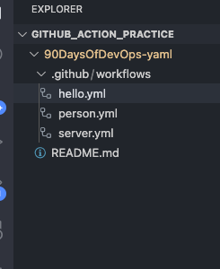

# Day 40 – Your First GitHub Actions Workflow

## Task

Today you write your **first GitHub Actions pipeline** and watch it run in the cloud.

This is the moment CI/CD stops being a concept and becomes real.

---

---

## Challenge Tasks

### Task 1: Set Up

1. Create a new **public** GitHub repository called `github-actions-practice`
   I have created this one:
   pramodtidke@Pramods-MacBook-Air 90DaysOfDevOps-yaml % pwd
   /Users/pramodtidke/Github_action_practice/90DaysOfDevOps-yaml

2. Clone it locally

yes i clone it locally

3. Create the folder structure: `.github/workflows/`
   

   GITHUB_ACTION_PRACTICE
   │
   └── 90DaysOfDevOps-yaml
   │
   ├── .github
   │ └── workflows
   │ ├── hello.yml
   │ ├── person.yml
   │ └── server.yml
   │
   └── README.md

---

### Task 2: Hello Workflow

Create `.github/workflows/hello.yml` with a workflow that:

1. Triggers on every `push`
2. Has one job called `greet`
3. Runs on `ubuntu-latest`
4. Has two steps:
   - Step 1: Check out the code using `actions/checkout`
   - Step 2: Print `Hello from GitHub Actions!`

Push it. Go to the **Actions** tab on GitHub and watch it run.

**Verify:** Is it green? Click into the job and read every step.

code:  
 name: GitHub Actions Practice Workflow

on: push

jobs:
greet:
runs-on: ubuntu-latest

    steps:
      - name: Checkout Repository
        uses: actions/checkout@v4

      - name: Print Greeting
        run: echo "Hello from GitHub Actions!"

Yesss i check the githib action code and its gree tick and all working fine

---

### Task 3: Understand the Anatomy

Look at your workflow file and write in your notes what each key does:

- `on:` Defines when the workflow should trigger

Example:

on: push

Means the pipeline runs every time code is pushed.

Other triggers:

pull_request
schedule
workflow_dispatch

- `jobs:` Defines tasks that run in the workflow

Example:

jobs:
greet:

This workflow has one job called greet.

- `runs-on:` runs-on:

Defines which machine executes the job

Example:

runs-on: ubuntu-latest

GitHub provides a Linux VM runner.

Other options:

windows-latest
macos-latest

- `steps:`Steps are individual actions or commands executed inside a job.

Example:

steps:

Each job contains multiple steps.

- `uses:` Used to run pre-built GitHub Actions

Example:

uses: actions/checkout@v4

This action downloads the repository code into the runner.

Without this, the pipeline cannot access the repo files.

- `run:` Runs shell commands.

Example:

run: echo "Hello from GitHub Actions!"

The command executes inside the runner.

- `name:` (on a step)
  Provides a human-readable label.

Example:

- name: Print greeting

This name appears in the GitHub Actions UI.

---

### Task 4: Add More Steps

Update `hello.yml` to also:

1. Print the current date and time
2. Print the name of the branch that triggered the run (hint: GitHub provides this as a variable)
3. List the files in the repo
4. Print the runner's operating system

Push again — watch the new run.

name: Hello Workflow

on: push

jobs:
greet:
runs-on: ubuntu-latest

    steps:

      - name: Checkout repository
        uses: actions/checkout@v4

      - name: Print greeting
        run: echo "Hello from GitHub Actions!"

      - name: Print current date and time
        run: date

      - name: Print branch name
        run: echo "Branch: ${{ github.ref_name }}"

      - name: List repository files
        run: ls -la

      - name: Print runner OS
        run: echo "Runner OS: $RUNNER_OS"

---

### Task 5: Break It On Purpose

1. Add a step that runs a command that will **fail** (e.g., `exit 1` or a misspelled command)
   - name: Break pipeline
     run: exit 1
2. Push and observe what happens in the Actions tab
   git add .
   git commit -m "Break pipeline intentionally"
   git push

   Pipeline result:

🔴 FAILED

You will see:

✓ Checkout repository
✓ Print greeting
✓ Print date
✗ Break pipeline
How to Read Errors

Click the failed step.

Example output:

Run exit 1
Error: Process completed with exit code 1.

Key things to check:

Which step failed

Error message

Command output logs

Logs are your primary debugging tool in CI/CD.

3. Fix it and push again
   Remove the failing step.

Push again:

git add .
git commit -m "Fix pipeline"
git push

Pipeline becomes:

🟢 SUCCESS

---
